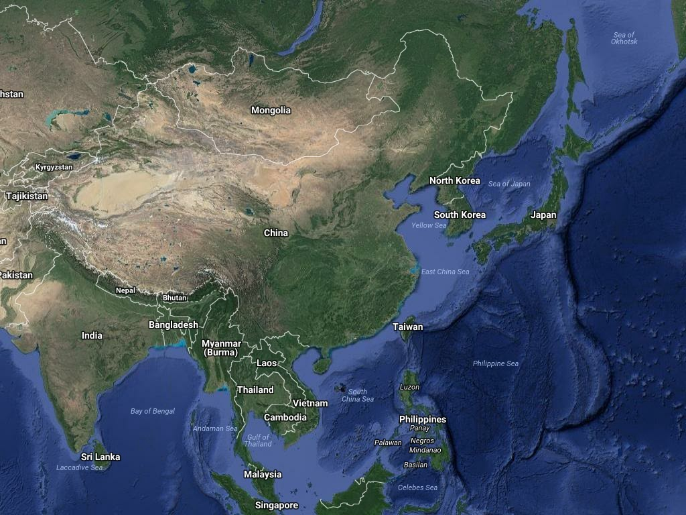

## Description

`gtdownloader` is used to download Google Maps satellite tiles and merge into a big one.

## Basic usage

Run `go get github.com/twoyao/gtdownloader` to install package. Show help info:

```
$ gtdownloader --help
Usage of gtdownloader:
  -lyrs string
    	lyrs parameter, y=hybrid s=satellite t=train m=map (default "y")
  -m value
    	markers coordinates, like 23.1,90.2
  -out string
    	output filename (default "out.jpg")
  -z int
    	zoom level, between 0 and 21 inclusive

```

Use `-m` to specify a set of marker coordinates(latitude, longitude). 
The constructed image will include all these markers. 
However, it's sufficient to just specify top-left and bottom-right markers. 
Here is an example download map of China at zoom level 4.
  
```
$ gtdownloader -m=55.228985,71.011028 -m=17.463627,137.560500 -z=4 -out=china.jpg
```


